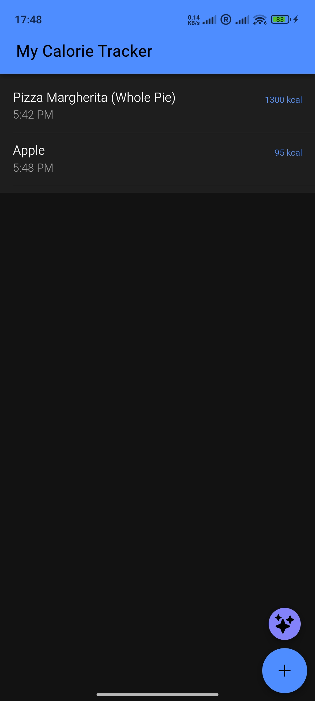
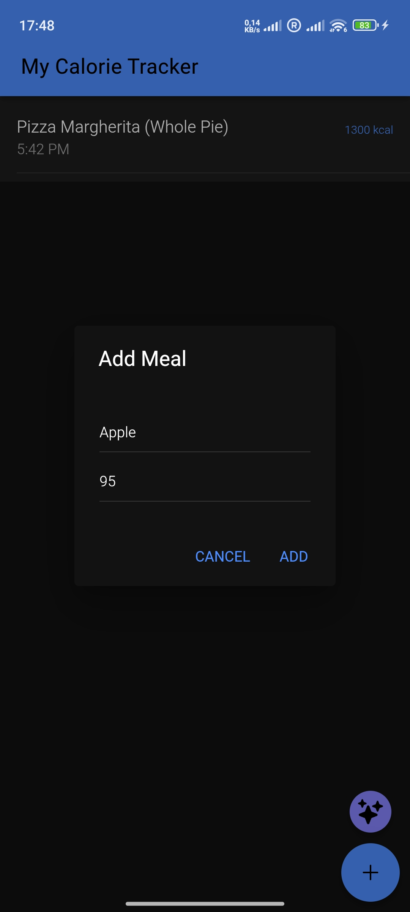

# 🥗 Smart Calorie Tracker

A modern, cross-platform application designed to help users track their daily food intake effortlessly. Built with **Ionic 8** and **Angular 20**, this app offers a flexible way to manage your diet: input meals manually for precision or let Artificial Intelligence estimate calories from a photo.



## 🌟 Key Features

### 📝 Core Functionality (Manual Control)

- **Track Your Meals:** Easily add breakfast, lunch, or dinner details (title and calories) to your daily log.
- **Local Persistence:** All data is securely saved on your device using **Ionic Storage** (IndexedDB/SQLite). Your history remains available even after restarting the app.
- **Manage Entries:** Delete old entries or mistakes with a simple swipe or click.

### ✨ AI-Powered Convenience

- **Photo Recognition:** Too lazy to type? Just snap a photo of your food! 📸
- **Google Gemini Integration:** The app uses the latest **Gemini Flash** model to analyze the image, identify the dish, and estimate calorie content automatically.

### 📱 Cross-Platform Experience

- **Hybrid Design:** Works seamlessly as a native **Android** app and as a responsive **Web Application** (PWA).
- **Native Features:** Utilizes Capacitor Camera and Filesystem APIs for a native feel on mobile devices.

---

add meal schreenshot:



## 🛠️ Tech Stack

- **Framework:** [Ionic 8](https://ionicframework.com/) + [Angular 20](https://angular.io/)
- **State Management:** [NgRx](https://ngrx.io/) (Store, Effects, Selectors) for robust data handling.
- **Artificial Intelligence:** [Google Gemini API](https://ai.google.dev/) (Generative AI).
- **Mobile Engine:** [Capacitor](https://capacitorjs.com/).
- **Storage:** `@ionic/storage-angular` for local data persistence.

---

### 🔑 Configuration (API Key)

**Important:** This project uses the **Google Gemini API**. For security reasons, the API key is not included in the repository. You must provide your own key.

1.  **Get a Key:** Go to [Google AI Studio](https://aistudio.google.com/) and generate a free API Key.
2.  **Create Config Files:** Inside the `src/environments/` folder, create a new file named `environment.ts`.
3.  **Add Your Key:** Paste the following code into `environment.ts`:

```typescript
export const environment = {
  production: false,
  geminiApiKey: "PASTE_YOUR_API_KEY_HERE",
};
```

For Android Build: Also create a file named environment.prod.ts in the same folder with production: true:

```typescript
export const environment = {
  production: true,
  geminiApiKey: "PASTE_YOUR_API_KEY_HERE",
};
```
